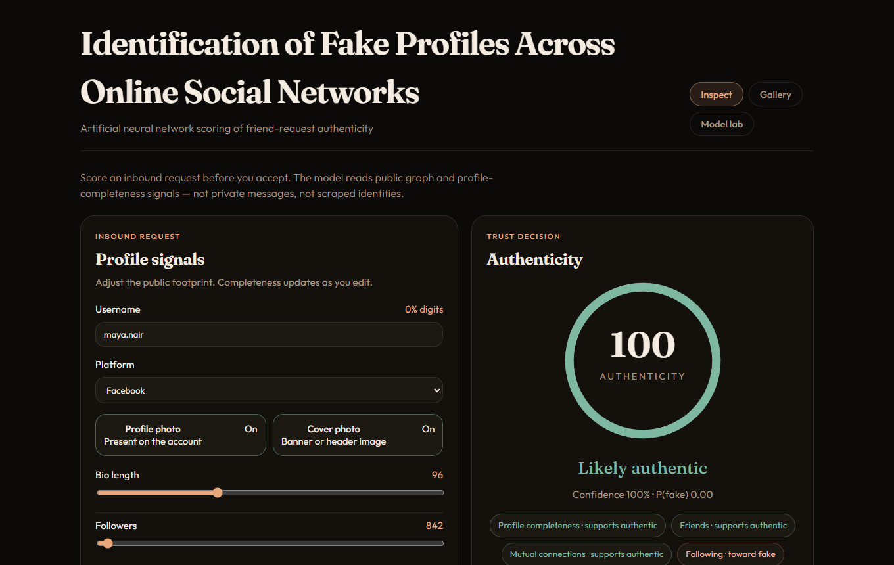
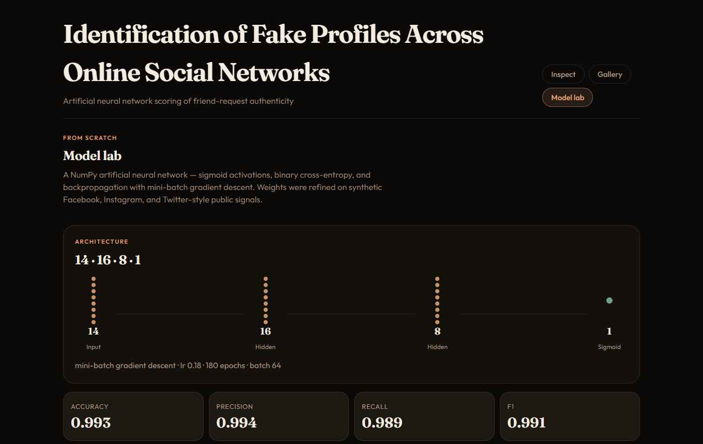

# Identification of Fake Profiles Across Online Social Networks

Trust-and-safety demo that scores inbound social profiles for authenticity. It implements the portfolio claim **Identification of Fake Profiles Across Online Social Networks**: a from-scratch artificial neural network (sigmoid activations, binary cross-entropy, backpropagation) trained on multi-platform public-profile signals.

The training corpus is **ethically generated synthetic data**. It mimics Facebook, Instagram, and Twitter-style *public* statistics (graph size, completeness, activity cadence). It does not contain scraped accounts or real people.

[](https://github.com/Saisriya2003/identification-of-fake-profiles-across-online-social-networks/actions/workflows/ci.yml) [](LICENSE) [](backend/tests) [](docker-compose.yml)

Full documentation — architecture, the neural network in depth, data, training results, API, UI workflow, configuration, CI: **[DOCUMENTATION.md](DOCUMENTATION.md)**.

## Screenshots

| Inspect — live scoring with explanation | Model lab — architecture, metrics, loss curve |
| --- | --- |
|  |  |

## Quick start

**Requirements:** [Python 3.11+](https://www.python.org/downloads/) and [Node.js 18+](https://nodejs.org/) on your PATH. No API keys, no database server. Trained model weights are included in the repo. Prefer containers? See [Run with Docker](#run-with-docker).

```bash
git clone https://github.com/Saisriya2003/identification-of-fake-profiles-across-online-social-networks.git
cd identification-of-fake-profiles-across-online-social-networks
```

Then run the one-command starter for your OS. It installs dependencies on first run, starts the API on `http://127.0.0.1:8001` and the UI on `http://localhost:5173`, and opens the browser.

| OS | Command |
| --- | --- |
| Windows (PowerShell) | `.\start.ps1` |
| macOS / Linux | `chmod +x start.sh && ./start.sh` |

If PowerShell refuses to run the script ("running scripts is disabled"), use:

```powershell
powershell -ExecutionPolicy Bypass -File .\start.ps1
```

Manual steps are under **How to run** below. CI runs the same install, API smoke test, and production build on every push.

### Troubleshooting

- **`python` not found** — on macOS/Linux use `python3`; on Windows install from python.org and tick "Add to PATH".
- **Port 8001 or 5173 already in use** — stop the other process, or change the port in `start.ps1` / `start.sh` and `frontend/vite.config.js` together.
- **Blank page / "Signal service unreachable"** — the API is not up yet. Check `http://127.0.0.1:8001/api/health`.

| | |
| --- | --- |
| Stack | Python, NumPy, FastAPI, React, Vite |
| Model | From-scratch ANN, sigmoid activations, backpropagation |
| Data | Synthetic multi-platform profiles (`backend/data/profiles.csv`) |
| Screens | Inspect (score a profile), Gallery (sample profiles), Model lab (metrics) |

## Resume mapping

| Claim | Where it lives |
| --- | --- |
| Deep learning ANN for friend-request authenticity | `backend/app/ann.py` — NumPy forward pass, sigmoid, BCE, mini-batch backprop |
| Facebook and other platforms | Synthetic corpus with a `platform` column: `facebook`, `instagram`, `twitter` |
| Sigmoid + backpropagation on weights and biases | Every hidden and output unit; SGD updates `W` and `b` each batch |
| Team project, AI/ML, April–May 2025 | This demo is the reproducible technical artifact from that work |

The positive class during training is **fake**. The product UI reports an **authenticity** score (`1 − P(fake)`).

## Architecture

```
React (Vite)  ──POST /api/predict──►  FastAPI
     │                                    │
Inspect / Gallery / Model lab             ├─ min-max scaler (scaler.json)
                                          ├─ NumPy ANN (ann_weights.npz)
                                          └─ metrics.json + profiles.csv
```

Input features (normalized 0–1): followers, following, friends, posts, account age, profile/cover photo flags, bio length, username digit ratio and length, mutuals on the request, profile completeness, average likes, posts per week.

Feature contribution in the API is an **input × first-layer weight** heuristic: the first-layer matrix is collapsed through later layers so each signal gets a signed magnitude the UI can explain.

## How to run (Windows PowerShell)

From the repo root `identification-of-fake-profiles-across-online-social-networks`.

### Backend

```powershell
cd backend
python -m venv .venv
.\.venv\Scripts\Activate.ps1
pip install -r requirements.txt
python -m app.generate_data
python -m app.train
uvicorn app.main:app --reload --host 127.0.0.1 --port 8001
```

If `Activate.ps1` is blocked by execution policy, call the interpreter directly:

```powershell
.\.venv\Scripts\python.exe -m uvicorn app.main:app --reload --host 127.0.0.1 --port 8001
```

Weights shipped in `backend/models/` are already trained. You can skip generate/train unless you want to regenerate them.

Health check: `http://127.0.0.1:8001/api/health`

### Frontend

```powershell
cd frontend
npm install
npm run dev
```

Open `http://localhost:5173`. Vite proxies `/api` to `http://127.0.0.1:8001`.

Production build (must succeed):

```powershell
cd frontend
npm run build
```

## API

| Method | Path | Purpose |
| --- | --- | --- |
| GET | `/api/health` | Liveness + whether weights are loaded |
| GET | `/api/metrics` | Accuracy, precision, recall, F1, confusion matrix, loss history, architecture |
| GET | `/api/samples?label=fake\|real` | Eight seeded profiles from the CSV |
| GET | `/api/platforms` | Counts by network and label |
| POST | `/api/predict` | Feature dict → `{ score, label, confidence, explanation }` |

## Stack

- Python 3.12, FastAPI, uvicorn, NumPy, pandas
- scikit-learn **metrics only** (no MLP)
- React 18 + Vite (JavaScript)

## Data note

`backend/data/profiles.csv` is synthetic (~4000 rows). Fake rows are statistically newer, thinner, more follow-heavy, more digit-laden in the handle, and colder on mutuals — the same public cues a reviewer uses on a friend request. Do not treat scores as a real-world moderation decision.

## Run with Docker

Two containers: the FastAPI service (with the trained weights baked in) and nginx serving the built React UI, proxying `/api` to the API.

```bash
docker compose up --build
# UI  http://localhost:5173        API  http://localhost:8001/api/health
```

Change host ports with `WEB_PORT` / `API_PORT` (for example `WEB_PORT=8080 docker compose up`). Stop with `docker compose down`.

## Tests

`backend/tests` — 19 pytest tests: a finite-difference **gradient check** that proves the hand-written backpropagation matches numerical gradients, training convergence on separable data, save/load round-trip, feature scaling and completeness, and every API endpoint against the committed artifacts.

```bash
cd backend
pip install -r requirements-dev.txt
python -m pytest
```

CI runs the suite on every push, then boots the API and builds the UI.

## License

MIT — see [LICENSE](LICENSE). The corpus is synthetic; no real accounts or personal data are included.